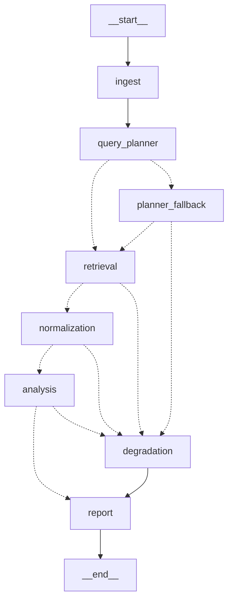

# Agentic Search Intelligence System

A multi-agent pipeline that answers questions about how a brand shows up in search results
and in AI-generated answers. It plans what to look up, fetches the data, cleans it, works out
what it means, and writes a report.

Built with LangGraph, FastAPI and PostgreSQL.

---

## What it does

You register a brand profile. You trigger a run. The system:

1. Works out which search queries are worth measuring for that brand.
2. Looks each one up through DataForSEO (SERP, AI Overview, LLM answers, keyword volume).
3. Turns the raw API responses into clean records.
4. Finds the gaps: queries with real demand where the brand is missing and rivals are not.
5. Writes a report with content recommendations.

---

## Quick start

You need Docker. Nothing else.

```bash
cp .env.example .env
docker compose up --build
```

That starts PostgreSQL and the API together on <http://localhost:8000>.
API docs are at <http://localhost:8000/docs>. Stop it with Ctrl+C.

If you have `make`, `make run` is the same thing.

It works straight away with no API keys. Out of the box it uses mocked DataForSEO responses
and a deterministic stub in place of a real LLM, so you get a complete, working run for free.

To use real services, edit `.env`:

```bash
LLM_PROVIDER=openai          # or anthropic, gemini
LLM_OPENAI_API_KEY=sk-...

DATAFORSEO_MODE=live
DATAFORSEO_LOGIN=your-email
DATAFORSEO_PASSWORD=your-api-password
```

### Running it locally instead of in Docker

Needs [uv](https://docs.astral.sh/uv/) and Python 3.12.

```bash
uv sync --extra dev                        # make install
docker compose up -d db                    # make db
uv run alembic upgrade head                # make migrate
uv run uvicorn sightline.composition.bootstrap:create_application --factory --reload
```

### Other commands

```bash
uv run pytest                              # make test
uv run ruff check src tests                # part of make check
uv run mypy                                # part of make check
uv run lint-imports                        # verify the layer boundaries
```

### On Windows

Everything works, but `make` is not available by default and the Makefile needs a Unix
shell. Use the direct commands above, or install `make` through WSL2 or Git Bash and the
shortcuts work as written.

Docker itself behaves identically on Windows, macOS and Linux, because the container is
Linux either way. In Command Prompt use `copy .env.example .env` instead of `cp`.

| Shortcut | Direct command |
|---|---|
| `make run` | `docker compose up --build` |
| `make stop` | `docker compose down --volumes` |
| `make db` | `docker compose up -d db` |
| `make migrate` | `uv run alembic upgrade head` |
| `make test` | `uv run pytest` |

### If a port is already in use

The API uses 8000 and PostgreSQL 5432. Both are common, so both are configurable. Set them
in `.env` before starting:

```bash
API_HOST_PORT=8188
POSTGRES_HOST_PORT=5433
```

---

## Try it

```bash
# create a profile
curl -X POST localhost:8000/api/v1/profiles -H 'Content-Type: application/json' -d '{
  "name": "Surfer SEO",
  "domain": "surferseo.com",
  "industry": "SEO Software",
  "description": "AI-powered SEO content optimization tool",
  "competitors": ["clearscope.io", "marketmuse.com", "frase.io"]
}'

# run the pipeline (takes 10-30 seconds against real providers)
curl -X POST localhost:8000/api/v1/profiles/<uuid>/run

# see what it found, best opportunities first
curl "localhost:8000/api/v1/profiles/<uuid>/queries?min_score=0.5"
```

---

## Endpoints

| Method | Path | What it does |
|---|---|---|
| POST | `/api/v1/profiles` | Register a brand |
| GET | `/api/v1/profiles/{uuid}` | Profile plus run statistics |
| POST | `/api/v1/profiles/{uuid}/run` | Run the full pipeline |
| GET | `/api/v1/profiles/{uuid}/queries` | Queries found, best first. Filters: `min_score`, `status`, `page`, `per_page` |
| GET | `/api/v1/profiles/{uuid}/recommendations` | Content suggestions |
| POST | `/api/v1/queries/{uuid}/recheck` | Re-measure one query |
| GET | `/health` | Readiness and which providers are active |

Runs are synchronous. A run takes 10 to 30 seconds with real providers. There is no job queue;
see "What I would do next" below.

---

## The pipeline



Dotted lines are conditional. There are five points where the graph can branch.

`retrieval` runs in parallel, one branch per planned query, using LangGraph's `Send`.
A typical run measures six queries at once and makes about twenty API calls.

`degradation` is the safety net. If retrieval fails, or normalization finds nothing usable, or
analysis is unavailable, the run does not crash. It routes to `degradation`, which records why,
and then to `report`, which still produces a document. The run comes back as `partial` with a
reason attached.

### What each agent does

Each node does one job and only one job.

| Node | Job | What it must not do |
|---|---|---|
| `ingest` | Sort out the run's inputs | anything else |
| `query_planner` | Decide which queries to measure | touch any API |
| `retrieval` | Call DataForSEO | read or interpret the results |
| `normalization` | Turn raw responses into clean records | fetch anything, or draw conclusions |
| `analysis` | Work out what the data means | fetch anything, or format output |
| `report` | Put the final document together | draw new conclusions |
| `planner_fallback` | Build a plan without an LLM | called only when the planner fails |
| `degradation` | Record why a run could not finish | build the report |

Two extra notes:

**Retrieval hands back raw, unparsed responses.** Parsing belongs to the normalizer. If
retrieval also parsed, those would be one component, not two.

**Opportunity scores are calculated in code, not by the model.** The formula lives in
`domain/services/opportunity_scoring.py`. A scoring rule that lives inside a prompt drifts
quietly between runs.

### The score

Three parts, weighted:

- **Demand (0.35)** — search volume, on a log scale. Search volume is very skewed. The jump
  from 100 to 1,000 matters far more than 100,000 to 101,000.
- **Winnability (0.25)** — the inverse of competition difficulty.
- **Visibility gap (0.40)** — how much room there is to improve. Ranked first means no gap.
  Absent means all gap. This carries the most weight because the whole point is closing gaps.

If a query could not be measured, the gap counts as 0.5, not 1.0. A failed lookup is missing
data, not proof the brand is absent, and it should not float to the top of the list.

---

## Tool calling

Every tool is a Pydantic model with typed fields and descriptions. The model is shown the same
schema that its arguments are then checked against, so the two cannot drift apart.

There is one tool per API call, not one big "call DataForSEO" tool:

`fetch_organic_serp` · `fetch_ai_overview` · `fetch_llm_visibility` · `fetch_keyword_metrics`

The model decides which tools to call and with what arguments. Before anything reaches the
network, the arguments go through a gate in `tools/validation.py`:

```
model proposes  ->  validate  ->  repair retry  ->  built-in fallback  ->  execute
```

If the gate rejects a call, the model gets one more attempt with a plain-English hint saying
exactly what was wrong. If it still cannot produce a valid call, the node builds the call
itself from the plan. Both paths go through the same gate. There is no way to reach the
network without passing it.

Rejected calls do not sink the run. If the model proposes four calls and one is bad, the other
three still run.

---

## When things go wrong

**Retries.** Exponential backoff with jitter. Jitter matters here because retrieval fans out in
parallel. Without it, a single rate limit would put every branch on the same retry schedule and
they would collide again on the next attempt.

**Knowing what to retry.** One module decides. Timeouts, connection errors, 429s and 5xx get
retried. 400s, 401s and 403s do not, because repeating them changes nothing. A failed auth
never echoes the response body, since that body can contain the credential that was sent.

**Retry-After.** If the server says how long to wait, that wins. It is jittered upward only, so
a retry can never happen sooner than the server asked.

**DataForSEO returns HTTP 200 for application errors.** The real result is a number inside the
response body, at two levels. So the body is checked as well as the status line. A client that
only looks at the HTTP status treats "out of credits" and "success" the same way.

**Circuit breaker.** After five failures in a row it stops calling and fails immediately for
thirty seconds, then lets one request through to test the water. A 400 or 401 does not trip it:
that means our request is wrong, not that the service is down.

### A failure, worked through

Feeding a constant 503 to the mocked provider:

```
status                : partial
degradation_reason    : upstream_circuit_open
planned / succeeded   : 6 / 0
api calls / retries   : 21 / 20
circuit.opened events : 1
still returned report : yes
```

Twenty-one calls, not the sixty-plus it would have been. The breaker cut it short. The run came
back `partial`, with a report saying coverage was incomplete, not a 500. Once the provider
recovered, the next run completed normally.

You can reproduce this. The mock transport takes queued faults:

```python
transport.queue_faults(MockFault.rate_limited(retry_after_seconds=2), MockFault.server_error())
```

---

## Logging and tracing

Every log line is JSON. Every request gets a correlation ID, which is returned in the
`X-Correlation-ID` header and included in error responses. That ID follows the request through
every node, every parallel branch, and every outbound API call.

One ID gives you the whole run:

```
node.completed  ingest          0.18ms  status=ok
node.completed  query_planner   0.16ms  status=ok  planned=6
node.completed  retrieval       2.09ms  status=ok  payloads=4 rejected_calls=0
node.completed  retrieval       1.47ms  status=ok  payloads=4 rejected_calls=0
node.completed  retrieval       1.39ms  status=ok  payloads=4 rejected_calls=0
node.completed  retrieval       1.19ms  status=ok  payloads=3 rejected_calls=0
node.completed  retrieval       0.77ms  status=ok  payloads=2 rejected_calls=0
node.completed  retrieval       1.29ms  status=ok  payloads=4 rejected_calls=0
node.completed  normalization   0.90ms  status=ok  normalized_queries=6 observations=21
node.completed  analysis        0.84ms  status=ok  insights=3 recommendations=3
node.completed  report          0.60ms  status=ok  rendered_by=llm
pipeline.finished                       status=completed queries=6 tokens=11652
```

A raw line looks like this:

```json
{"event":"dataforseo.call.failed","service":"dataforseo","endpoint":"/v3/serp/google/organic/live/advanced",
 "status_code":503,"error_type":"RetryExhaustedError","retryable":false,"attempts":3,"duration_ms":1275.53,
 "mode":"mock","node":"retrieval","correlation_id":"979662ba18cb488d981d6db2277a7211",
 "run_uuid":"ce29fbde-e3e9-4d2e-a9f7-e0944969d98d","level":"error","timestamp":"2026-09-06T23:02:08.186172Z"}
```

Secrets are stripped by the logging pipeline itself, not by remembering to leave them out at
each call site. Passwords, API keys, `Authorization` headers and login names are all replaced
with `***REDACTED***`. Values that look like credentials are caught even when the field name
looks harmless. Token counts survive, because those are metrics we need.

Each run also collects per-node timing, success rates, API call counts and retry totals. They
come back in the run response under `metrics` and are stored with the run.

### What I would add for production

- **OpenTelemetry** instead of the custom correlation context, so traces join up with the rest
  of the estate. The `node_span` wrapper is the seam; it becomes a real span.
- **Prometheus metrics** instead of the in-memory collector. `RunMetrics` already has the right
  shape for this, and swapping it means writing one adapter.
- **LangSmith** for prompt-level tracing. The hook is already wired. Set
  `OBSERVABILITY_LANGSMITH_API_KEY` and it attaches with no code change.
- **Alerting** on the signals that already exist: circuit breaker opening, the rate of `partial`
  runs, token spend per run.
- **Log sampling.** Right now every node logs its payload. At volume you would sample the
  successful ones and keep everything on failures.

---

## Tests

```bash
make test
```

392 tests. They run offline and take about 15 seconds. No API key needed and no network calls,
because the tests use the stub LLM provider and mocked DataForSEO. The database tests skip
themselves if PostgreSQL is not running, so a fresh clone still passes.

The three tests the brief asks for:

| Test | Where |
|---|---|
| Happy path run | `tests/integration/test_pipeline_dag.py::TestHappyPath` |
| Simulated API failure with retry and fallback | `tests/integration/test_pipeline_dag.py::TestSimulatedApiFailure` |
| Tool call argument validation | `tests/unit/test_tool_validation.py` |

Run everything including the database tests:

```bash
make db && make migrate && make test
```

---

## How the code is laid out

```
src/sightline/
  domain/          business rules. plain Python, no framework
  application/     use cases and the interfaces they depend on
  agents/          the LangGraph pipeline: nodes, routing, prompts
  tools/           tool definitions and the validation gate
  infrastructure/  database, DataForSEO, LLM providers, retries
  api/             FastAPI routes and request/response models
  observability/   logging, correlation IDs, metrics
  composition/     wires everything together
```

Dependencies point inwards. `domain` imports nothing from the rest of the project.
`infrastructure` is only reachable from `composition`.

This is not just a convention. It is checked by `import-linter` and `make lint` fails if it is
broken. During development it caught the API picking up an accidental dependency on the
database layer, which was invisible otherwise because the code still worked.

---

## Choices worth explaining

**PostgreSQL, no SQLite fallback.** The schema uses `JSONB` for reports and raw payloads,
native enums for statuses, arrays for competitor lists, and check constraints for the
0-1 and 0-100 ranges. Supporting SQLite too would mean giving all of that up.

**Domain rules are enforced twice.** The entity checks them, and so does the database. A query
marked "not visible" cannot carry a rank. The entity protects the application; the constraint
protects everything else, including migrations and manual fixes.

**Runs are saved before they start.** The run row is written as `running` before the pipeline
executes. If the process dies halfway, there is still a record showing a run began and never
finished. Writing everything at the end would leave nothing behind.

**A degraded run returns HTTP 200.** It comes back as `status: "partial"` with a reason. A run
that produced a partial answer is a successful request reporting incomplete coverage, not a
failed one.

**A failed recheck leaves the old measurement alone.** Overwriting good data with a failed
lookup would lose information over a temporary blip, which is the opposite of the point.

**Each query stores the evidence behind its verdict.** The observations a measurement came
from are kept as JSONB on the row. That is what lets a recheck report *what changed* — which
competing domain appeared or dropped out — rather than only that a score moved.

---

## Known limitations

**DataForSEO runs in mock mode by default, and mock is what I could verify.** The brief allows
this. But I want to be straight about what it means: the response parsers were written from the
API documentation, not from captured live responses. I never had credentials. The overall
response shape is standard and I am confident in it. Exact numeric status codes are handled by
range rather than matched one by one, precisely because I could not confirm them. If a field
name differs in the real API, that is where it would show. Everything above the transport, the
retries, error handling, circuit breaker and metrics, is identical in every mode and is tested.

**Runs are synchronous.** A run holds the HTTP connection for 10 to 30 seconds. Fine at this
size, wrong at scale.

**No authentication.** The brief says it is out of scope.

**Recommendations are dropped if they reference a query that was not measured.** Safer than
guessing which query the model meant, but it does mean occasionally losing a suggestion.

**No rate limiting or cost ceiling on LLM calls.** A run makes roughly nine model calls. There
is nothing stopping someone triggering many runs at once.

**One run, one profile.** No batching, no scheduling, no history comparison between runs. The
data model supports it, the API does not expose it.

## What I would do next

1. **Background jobs.** Celery or arq. Return a run ID straight away, poll for the result.
   The pipeline engine sits behind an interface already, so this is an API change, not a
   rewrite.
2. **Verify against the live API.** Run once with real credentials, capture the responses, and
   turn them into fixtures. Half a day at most.
3. **Cache DataForSEO responses.** Search results for the same keyword do not change hour to
   hour. A day of caching would cut costs a lot.
4. **Track history.** Every run currently discovers queries fresh. Linking runs would let you
   show whether visibility is improving, which is the actual product question.
5. **OpenTelemetry and Prometheus**, as described above.
6. **Auth and per-tenant limits** before anyone else uses it.

---

## Configuration

See `.env.example`. Every setting is documented there with a comment. Nothing has a hardcoded
default anywhere in the code.

The main ones:

| Setting | Default | Notes |
|---|---|---|
| `LLM_PROVIDER` | `fake` | `openai`, `anthropic`, `gemini`, or `fake` for offline |
| `DATAFORSEO_MODE` | `mock` | `mock`, `sandbox` or `live` |
| `RESILIENCE_MAX_ATTEMPTS` | `3` | Includes the first try |
| `PIPELINE_MAX_PLANNED_QUERIES` | `8` | Each one costs about 4 API calls |
| `OBSERVABILITY_LOG_FORMAT` | `json` | Use `console` for readable local logs |

If you select a provider without giving it a key, the app refuses to start and tells you which
variable is missing. It does not wait until the first request to find out.
